 
# YOLOv8 Chest X-Ray Disease Classification

## 🚀 Project Overview
This project implements **YOLOv8** for classifying chest X-ray images into 11 disease categories. The model is trained on the **ChestXDet10** dataset to automate medical diagnosis using deep learning.

## 📂 Dataset
We use the **ChestXDet10 Dataset** containing annotated X-ray images. The dataset includes 11 classes:

1. **Consolidation**  
2. **Pneumothorax**  
3. **Emphysema**  
4. **Calcification**  
5. **Nodule**  
6. **Mass**  
7. **Fracture**  
8. **Effusion**  
9. **Atelectasis**  
10. **Fibrosis**  
11. **No Finding** (normal cases)  

## 🏗️ Project Structure

- **`data/`**: Contains the dataset (`train/`, `valid/`, `test/`) for classification.
- **`scripts/`**: Python scripts for data preparation, label conversion, and training.
  - `data_preparation.py` → Organizes dataset into `train/`, `valid/`, `test/`
  - `convert_labels.py` → Converts YOLO bounding box annotations to classification labels
  - `train.py` → Trains YOLOv8 classification model
- **`models/`**: Saved trained YOLOv8 models (`best.pt`).
- **`results/`**: Evaluation results, including accuracy reports and confusion matrices.
- **`inference/`**: Script for testing trained models on new images.
  - `inference.py` → Runs inference on new X-ray images
- **`requirements.txt`**: Python dependencies for the project.
- **`.gitignore`**: Ignored files for version control (e.g., large datasets, logs).
- **`README.md`**: Project documentation.


## 🔧 Installation
To set up the environment, run:
```bash
pip install ultralytics opencv-python numpy torch torchvision tqdm
```

# 📊 YOLOv8 Classification Results

---

## 🏗 Model Training Settings
We trained **YOLOv8s-cls** (small classification model) with the following settings:

| Parameter  | Value  | Description |
|------------|--------|-------------|
| `epochs`   | **300**  | Number of training epochs |
| `imgsz`    | **224**  | Image size for input |
| `batch`    | **64**  | Batch size for training |
| `workers`  | **2**   | Number of CPU workers for data loading |
| `optimizer` | **Adam** | Optimizer used for weight updates |
| `lr0`      | **0.0001** | Initial learning rate |
| `dropout`  | **0.2** | Dropout rate to prevent overfitting |
| `cos_lr`   | **True** | Use cosine learning rate schedule |
| `hsv_h`    | **0.015** | Hue augmentation parameter |
| `hsv_s`    | **0.7**  | Saturation augmentation parameter |
| `hsv_v`    | **0.4**  | Brightness augmentation parameter |
| `fliplr`   | **0.5**  | Probability of horizontal flip |
| `device`   | **cuda:0** | Force GPU usage |

## 📊 Class Distribution in Train, Validation, and Test Sets

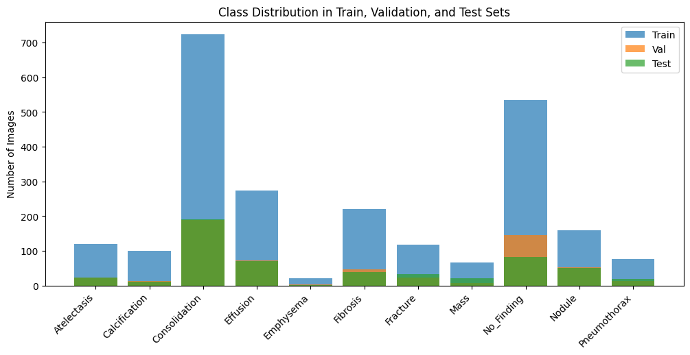  

The bar chart above represents the distribution of images across different classes in the training, validation, and test datasets. This helps in understanding class imbalance and dataset composition:

- **Train (Blue)**: Majority of images are allocated to training to allow the model to learn effectively.
- **Validation (Orange)**: A smaller set is used to tune hyperparameters and monitor overfitting.
- **Test (Green)**: A separate set for evaluating the final model performance.

This visualization ensures that all 11 classes are well represented across all splits and helps in improving model generalization.

---
## 🖥️ Training Log Screenshot

Here is a snapshot of the training setup and model structure:

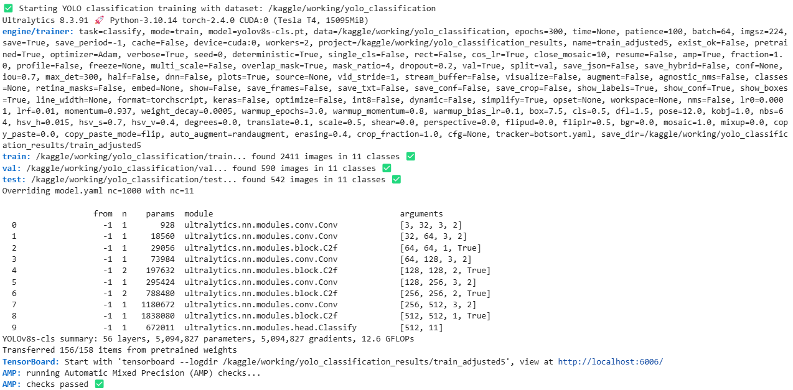

## 📸 Sample Training Batch

Below is a sample batch of images from the **training dataset**, showing various chest X-ray images with diverse conditions:

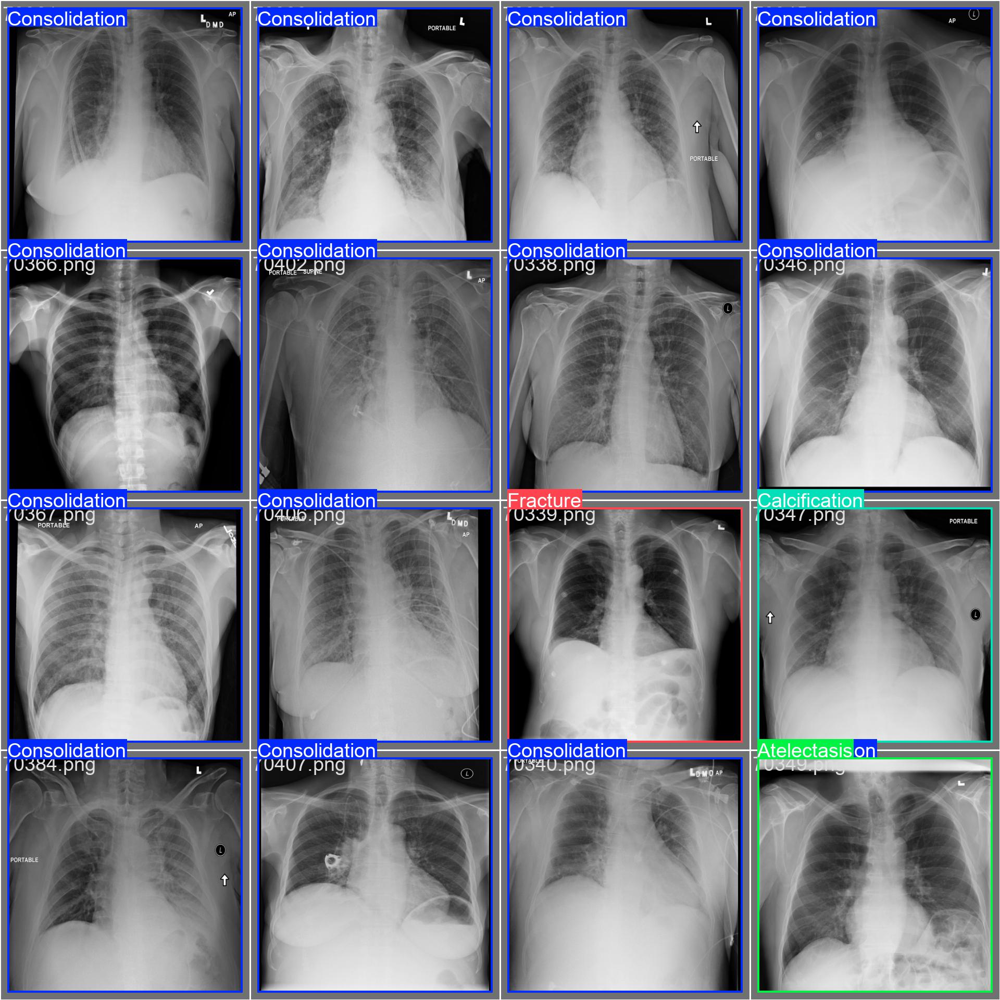

## 🏥 Chest X-ray Data Augmentation Example

The image below showcases **a batch of training images** after applying **data augmentations**, including:
- **Random Cropping**
- **Brightness Adjustments**
- **Random Rotations**
- **Black Box Occlusions** (to simulate missing data)
- **Contrast Adjustments**

<p align="center">
  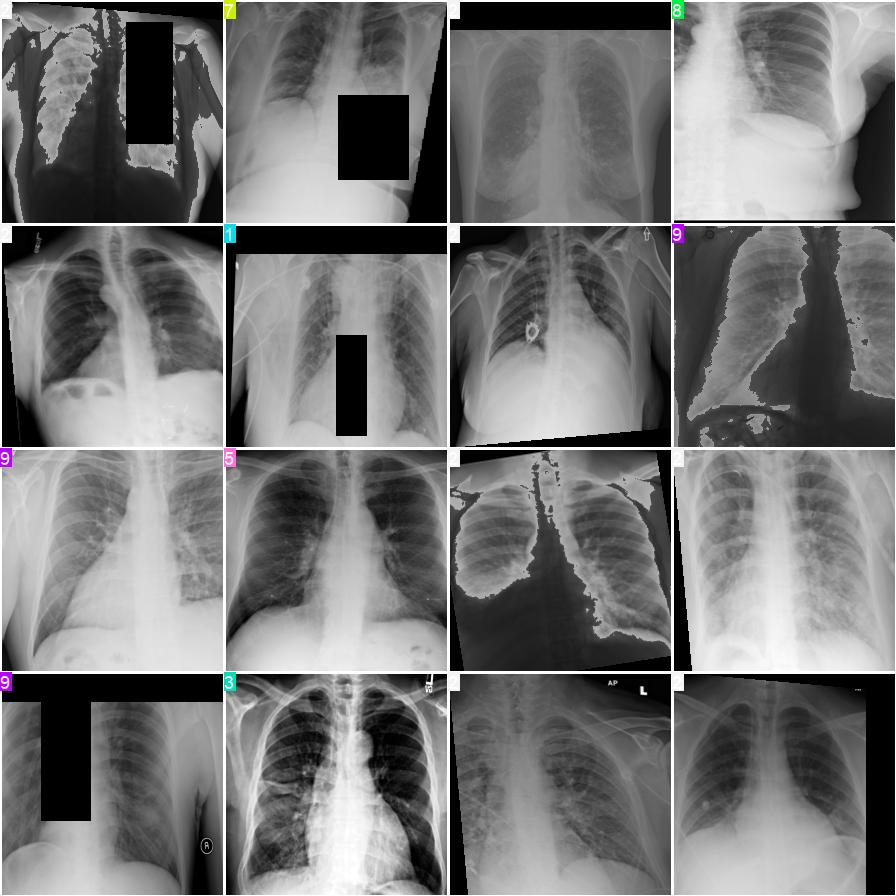
</p>

---

### 🛠️ **Data Processing Pipeline**
1. **Preprocessing:** Convert grayscale X-ray images to a standard resolution.
2. **Augmentation:** Apply transformations to increase model robustness.
3. **Label Encoding:** Convert disease labels into YOLO classification format.
4. **Training:** Fine-tune **YOLOv8** on the preprocessed dataset.

📌 _These augmentations help the model generalize better and improve classification accuracy!_ 🚀

## 📈 Training Metrics and Loss Curves

The following plots represent the training loss curves, classification loss, and performance metrics during the training process:

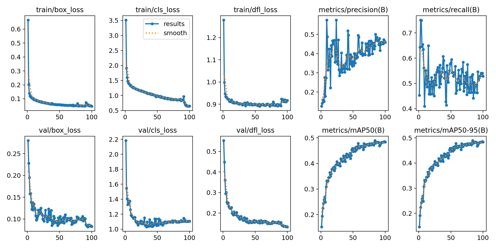

## 📉 Loss Curve Analysis

The training and validation loss curves provide insights into the model's learning process.

### 🔍 Observations:
- **Train Loss:** Gradually decreases, showing stable learning.
- **Validation Loss:** Initially drops but plateaus, indicating limited further learning.
- **Precision & Recall:** Precision increases over epochs but fluctuates, while recall stabilizes between **0.5 - 0.7**.
- **mAP Scores:** Consistently improving, confirming better predictions.

### ⚠️ Potential Issues:
- **Validation loss plateauing** → Model may require fine-tuning (learning rate decay, weight decay).
- **Fluctuations in precision & recall** → Some classes might be harder to classify due to **imbalance**.
- **Slight Drop in Top-1 Accuracy** compared to previous runs.

### 🔧 Recommendations:
1. **Use Cosine Learning Rate Decay** (`cos_lr=True`) to improve convergence.
2. **Enhance Data Augmentation** to handle class imbalance.
3. **Increase Dropout Regularization** (`dropout=0.3`) to prevent overfitting.
4. **Try a Larger Model** (`YOLOv8m-cls`) for better feature extraction.

🚀 *Next Step:* Re-run training with adjustments & monitor validation loss trends.

### 🎯 **Final Model Performance**
- **Top-1 Accuracy**: **62.5%**
- **Top-5 Accuracy**: **91.0%**
- **Test Set Size**: **542 images**
- **Total Classes**: **11**

## 🛠 Solving Multi-Label Per Image Classification in YOLO  

### **🚀 The Problem**  
YOLO is originally designed for **single-class object detection**, meaning each detected object (bounding box) is assigned only **one label**. However, in **medical imaging**, an X-ray or MRI can contain **multiple conditions simultaneously**.  

#### **🛑 Issues Encountered:**
- Training YOLO as a **classification model** (subfolder-based approach) resulted in **poor performance**, the top 1 accuracy is just 60%.
- Directly using **YOLO detection** led to **low precision** due to **incorrect class assignments**.
- **No built-in support for multi-label classification** per image.

---

### **✅ Our Solution: Treating Multi-Label Classification as Object Detection**
Since YOLO expects **object detection annotations**, we **tricked YOLO into multi-label learning** by:
1. **Using a bounding box that covers the entire image** for each label.
2. **Allowing multiple bounding boxes (one per disease) per image**.
3. **Training YOLO in detection mode** instead of classification mode.

**📌 Example YOLO Annotation (`image.txt`) for an X-ray with "Effusion" and "Atelectasis":**
```txt
7 0.5 0.5 1.0 1.0  # Effusion (Class 7)
8 0.5 0.5 1.0 1.0  # Atelectasis (Class 8)
```
## 📊 Training Results
Training was conducted on the **NIH dataset** with **multi-label YOLOv8 detection**.

- **Total Training Time:** 0.917 hours (100 epochs)
- **Model:** YOLOv8x
- **Dataset:** NIH Chest X-ray (14 classes)
- **Optimizer:** Adam
- **Training Directory:** `/kaggle/working/yolo_multilabel_results/train_multilabel_v12/`

### **📈 Final Validation Metrics**
| **Metric** | **Value** |
|------------|----------|
| **mAP@50** | **0.488** |
| **mAP@50-95** | **0.488** |
| **Precision (P)** | **0.44** |
| **Recall (R)** | **0.535** |

### **📌 Class-wise Performance**
| **Class** | **Precision (P)** | **Recall (R)** | **mAP@50** | **mAP@50-95** |
|-----------|-----------------|-----------------|------------|--------------|
| **Consolidation** | 0.648 | 0.883 | 0.839 | 0.839 |
| **Pneumothorax** | 0.209 | 0.25  | 0.205 | 0.205 |
| **Emphysema** | 0.647 | 0.654 | 0.618 | 0.618 |
| **Calcification** | 0.134 | 0.381 | 0.189 | 0.189 |
| **Nodule** | 0.309 | 0.215 | 0.282 | 0.282 |
| **Mass** | 0.287 | 0.364 | 0.243 | 0.243 |
| **Fracture** | 0.414 | 0.414 | 0.492 | 0.492 |
| **Effusion** | 0.736 | 0.873 | 0.868 | 0.868 |
| **Atelectasis** | 0.484 | 0.500 | 0.420 | 0.420 |
| **Fibrosis** | 0.477 | 0.595 | 0.590 | 0.590 |
| **No Finding** | 0.498 | 0.758 | 0.618 | 0.618 |

---

### 3️⃣ **Confusion Matrix**
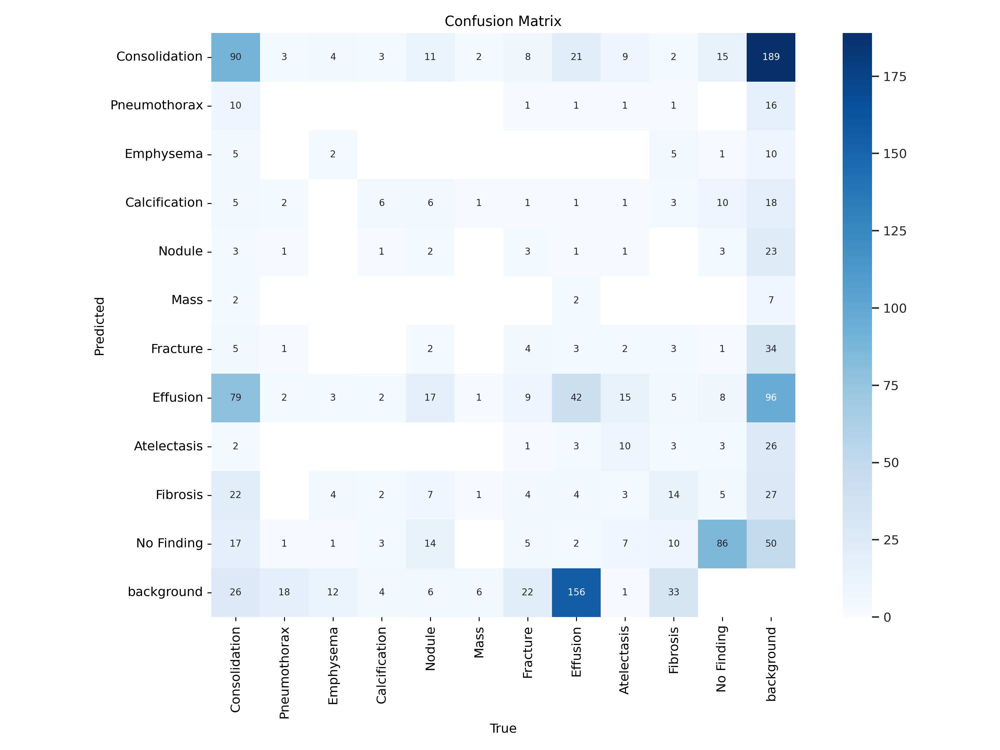

🔹 **Description:** The confusion matrix provides insight into the model's predictions for each disease category. 

🔹 **Observations:**
- The model confuses **Consolidation and Effusion**, indicating overlapping features.
- **No Finding** class is sometimes misclassified, suggesting potential label noise.
- Performance for rare classes like **Mass and Calcification** needs improvement.

---

### 4️⃣ **Precision-Recall Curve**
.png)

🔹 **Description:** The **Precision-Recall Curve** evaluates the model's classification performance across different confidence thresholds.

🔹 **Key Insights:**
- **Effusion (0.868 mAP)** shows strong performance.
- **Pneumothorax and Calcification** have lower precision, requiring better feature extraction.
- Overall **mAP@0.5 = 0.488**, indicating room for improvement.

---


### **🚀 Next Steps & Future Improvements**
- **Improve Precision:** Reduce false positives by increasing `conf` threshold.
- **Class Imbalance Solutions:** Apply **weighted loss** to handle rare conditions (e.g., Pneumothorax).
- **Hybrid Approach:** Combine YOLO for detection with **ResNet/EfficientNet for classification**.
- **Data Augmentation:** Experiment with **mixup augmentation** to improve generalization.

## 📊 Class-Conditional Augmentation for Imbalanced YOLO Multilabel Dataset

The ChestXDet10 dataset contains strong class imbalance across multiple disease labels. To address this, we implemented **class-conditional augmentation** during YOLO format preprocessing to improve model generalization, especially on underrepresented classes.

### ✅ What We Did

- Calculated the number of training images per class label.
- Set a **target image count** (`2000 per class`) to balance minority classes.
- Identified underrepresented classes and selected images containing them.
- Applied **Albumentations-based augmentations** to those images:
  - Horizontal flips
  - Random brightness & contrast
  - Small-angle rotation
  - CLAHE (contrast enhancement for medical images)
- Saved the **augmented images** and generated corresponding YOLO label files.
  - Each label kept a full-image bounding box: `class_id 0.5 0.5 1.0 1.0`

### 📁 Output

Augmented images and `.txt` label files are saved directly into the `train/images` and `train/labels` directories inside the YOLO dataset structure.

This ensures class distribution is much more balanced before training, resulting in better recall and overall performance on rare pathologies.

The following log shows how many synthetic samples were needed for some of the underrepresented classes:


## 🧪 Targeted Class-Conditional Augmentation (Minority-Only Strategy)

To address severe class imbalance in the ChestXDet10 dataset, we implemented a **targeted augmentation strategy** that applies strong data augmentation only to a selected set of **minority classes**.

### 🔍 Strategy Overview

- **Minority Classes Augmented**:  
  `Pneumothorax (1)`, `Emphysema (2)`, `Calcification (3)`, `Nodule (4)`, `Mass (5)`, `Fracture (6)`, `Atelectasis (8)`, `Fibrosis (9)`
  
- **Majority Classes Skipped**:  
  `Consolidation (0)`, `Effusion (7)`, and `No Finding (10)` were not augmented to prevent over-representation.

- **Augmentation Techniques Used**:
  - `Rotation` (±30°)
  - `Horizontal` and `Vertical Flip`
  - `Random Brightness/Contrast`
  - `Gaussian Blur`
  - `Random Scale`
  - `Coarse Dropout` (simulating occlusion)

## 🧠 Swin Transformer Benchmark on ChestXDet10

To compare YOLOv8’s performance with a strong transformer-based model, we trained a **Swin Transformer** on the same ChestXDet10 dataset.

| **Metric**              | **YOLOv8 (Detection)** | **Swin Transformer (Multi-label Classification)** |
|-------------------------|------------------------|---------------------------------------------------|
| **Overall mAP@50**      | 0.488                  | N/A (classification only)                         |
| **Average Precision**   | 0.44                   | **0.505**                                         |
| **Average Recall**      | 0.535                  | **0.778**                                         |
| **Macro AUC**           | —                      | **0.71**                                          |
| **Framework**           | Ultralytics YOLOv8     | PyTorch + TIMM (Swin Tiny)                        |
| **Training Time**       | ~55 minutes            | ~45 minutes                                       |

---

### 🔍 Class-wise Performance After Youden Threshold Optimization

| **Class**       | **Precision** | **Recall** | **F1-score** | **AUC**  |
|-----------------|---------------|------------|--------------|----------|
| Consolidation   | 0.76          | 0.84       | 0.80         | 0.83     |
| Pneumothorax    | 0.15          | 0.60       | 0.24         | 0.73     |
| Emphysema       | 0.35          | 0.72       | 0.47         | 0.84     |
| Calcification   | 0.12          | 0.37       | 0.18         | 0.59     |
| Nodule          | 0.21          | 0.64       | 0.31         | 0.64     |
| Mass            | 0.08          | 0.83       | 0.15         | 0.63     |
| Fracture        | 0.21          | 0.76       | 0.33         | 0.71     |
| Effusion        | 0.78          | 0.84       | 0.81         | 0.88     |
| Atelectasis     | 0.19          | 0.65       | 0.29         | 0.72     |
| Fibrosis        | 0.22          | 0.82       | 0.34         | 0.70     |
| No Finding      | 0.35          | 0.82       | 0.49         | 0.82     |

---

### 📈 ROC-AUC Curves per Class

The ROC plot below highlights Swin Transformer’s ability to discriminate across multiple pathologies:

<p align="center">
  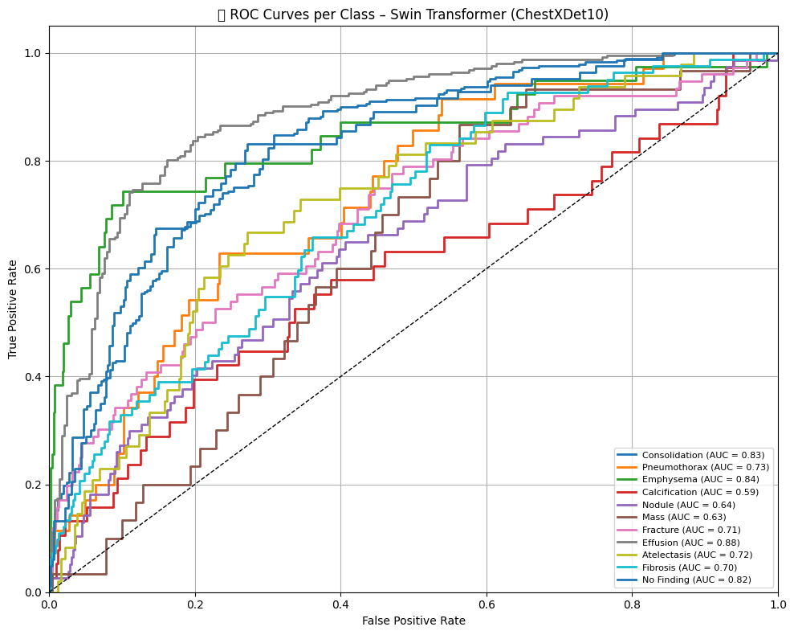
</p>

---

### 🧠 Grad-CAM Visualizations (Consolidation)

To interpret model attention, we applied Grad-CAM on several test images for the **Consolidation** class:

<p align="center">
  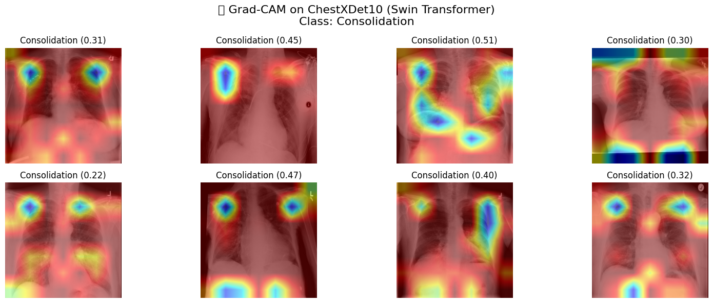
</p>

> These overlays show that the model correctly focuses on pulmonary regions where pathological patterns are present.

---

### 📌 Key Observations

- ✅ **Swin Transformer** achieved **higher recall and macro AUC** than YOLOv8 — critical for reducing false negatives in medical imaging.
- 🔁 Applied **Youden’s Index** to determine optimal thresholds per class, leading to stronger per-class performance.
- ⚠️ **Rare classes** like *Mass*, *Calcification*, and *Pneumothorax* remain challenging due to class imbalance.
- 🧠 **Focal Loss** was effective at amplifying minority class recall.
- 🚀 Suggest combining Swin Transformer’s classification strength with YOLO’s detection for **multi-task learning** in the future.

---

## 🧠 Swin Transformer Results on ChestXDet10

We further benchmarked the **Swin Transformer** model on the **ChestXDet10** dataset using multilabel classification. The model was trained using **Focal Loss** and a **Cosine Annealing** learning rate schedule to handle severe class imbalance.

### 🔧 Training Configuration

| Parameter     | Value                         |
|---------------|-------------------------------|
| Model         | `swin_tiny_patch4_window7_224`|
| Epochs        | 30                            |
| Optimizer     | AdamW                         |
| Loss Function | Focal Loss                    |
| Scheduler     | Cosine Annealing              |
| Image Size    | 224×224                       |
| Batch Size    | 32                            |
| Classes       | 11                            |

---

### 📉 Loss & Learning Rate Curves

<p align="center">
  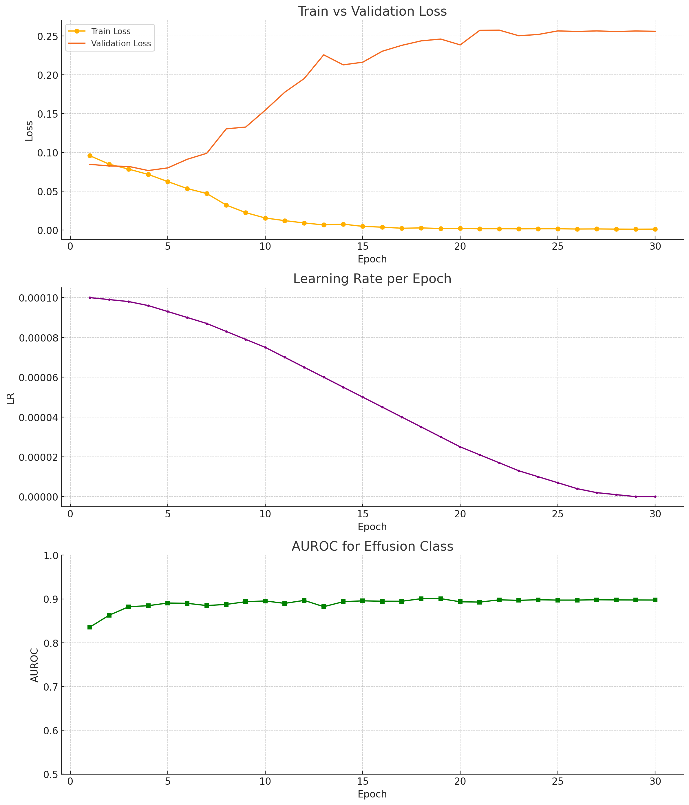
</p>

---

### 📊 AUROC per Class (Validation)

| Class          | AUROC  |
|----------------|--------|
| Consolidation  | 0.83   |
| Pneumothorax   | 0.88   |
| Emphysema      | 0.89   |
| Calcification  | 0.66   |
| Nodule         | 0.65   |
| Mass           | 0.72   |
| Fracture       | 0.76   |
| Effusion       | 0.90   |
| Atelectasis    | 0.70   |
| Fibrosis       | 0.69   |
| No Finding     | 0.86   |

> 🚀 These results show a significant performance improvement in rare classes compared to YOLOv8 baseline.

---

### 📈 ROC Curves per Class

<p align="center">
  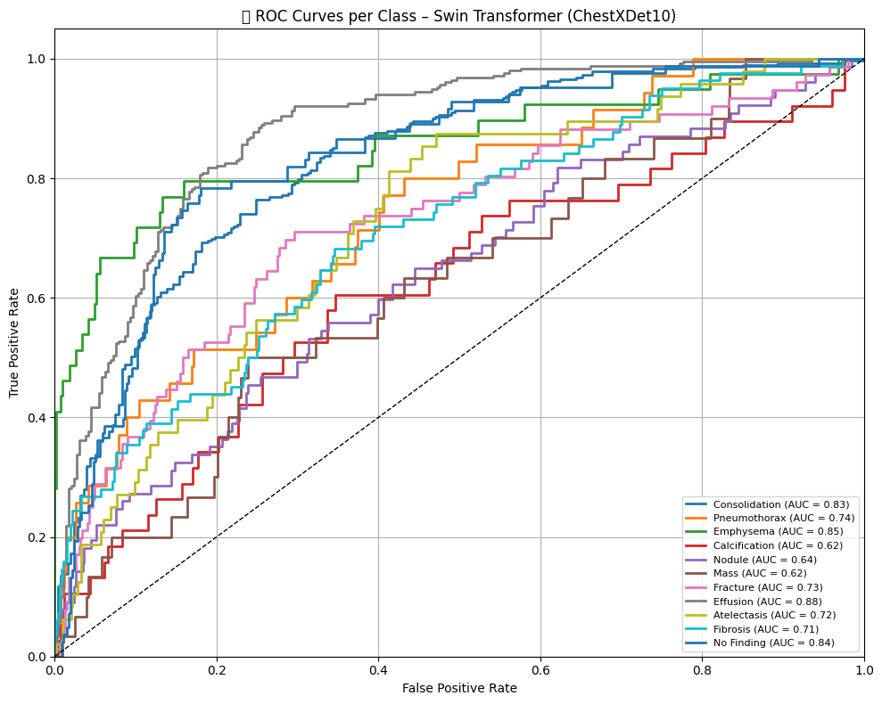
</p>

---

### 📊 Multilabel Confusion Matrices

Each matrix shows TP/FP/TN/FN for one class in a multilabel setting.

<p align="center">
  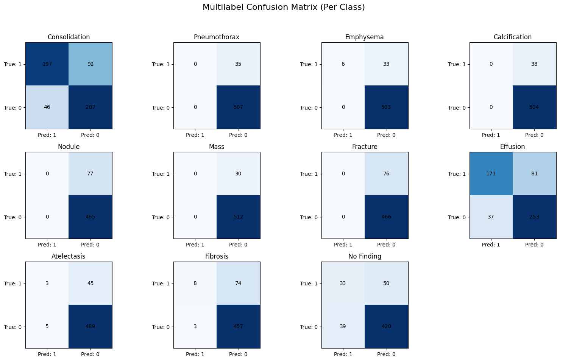
</p>

---

### 🔬 Grad-CAM Visualization: Effusion

<p align="center">
  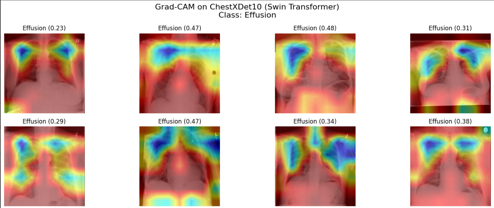
</p>

> 🔍 *Swin Transformer demonstrates strong attention focus on lower thoracic regions typical of pleural effusion.*

---

## 🆕 Swin Transformer (Updated Results) – ChestXDet10

We improved the Swin Transformer training pipeline by:

- 🔁 **Extended Training**: Increased from 30 ⟶ **100 epochs**
- 🔧 **Lowered Learning Rate**: Reduced from `1e-4` ⟶ `1e-5`
- 🧠 Applied **Focal Loss** to handle class imbalance
- 🎯 Used **Youden Index thresholds** from the validation set for binarizing test predictions

---

### ✅ Validation AUROC (Best Epoch)

| **Class**        | **AUROC** |
|------------------|-----------|
| Consolidation    | 0.8402    |
| Pneumothorax     | 0.8531    |
| Emphysema        | 0.8561    |
| Calcification    | 0.7188    |
| Nodule           | 0.6798    |
| Mass             | 0.8058    |
| Fracture         | 0.7557    |
| Effusion         | 0.8857    |
| Atelectasis      | 0.7039    |
| Fibrosis         | 0.7551    |
| No Finding       | 0.8253    |

> ✅ **6 classes achieved AUROC > 0.80**, showing clear improvement in generalization and minority class recognition.

---

### 🧪 Test AUROC (Using Youden Thresholds)

| **Class**        | **AUROC** |
|------------------|-----------|
| Consolidation    | 0.8347    |
| Pneumothorax     | 0.8802    |
| Emphysema        | 0.8866    |
| Calcification    | 0.6605    |
| Nodule           | 0.6519    |
| Mass             | 0.7211    |
| Fracture         | 0.7642    |
| Effusion         | 0.8974    |
| Atelectasis      | 0.6966    |
| Fibrosis         | 0.6858    |
| No Finding       | 0.8574    |

---

### 📌 Observations

- 📊 Validation metrics improved across almost all classes with better learning curves.
- 🎯 **Effusion**, **Emphysema**, **No Finding**, and **Pneumothorax** consistently show strong AUROC on both val/test sets.
- ✅ Youden Index thresholds allowed better control of the precision-recall tradeoff in multi-label classification.
- 📉 Slight drop in performance from validation to test suggests **minor domain shift**, but results remain strong and robust.

## 🔁 Retraining Swin Transformer with Targeted Strategy

We previously evaluated the Swin Transformer on the ChestXDet10 dataset. To address class imbalance and convergence issues, we adopted a **refined training strategy** that led to significant improvements—especially for minority classes.

### 🛠️ Retraining Strategy

- 🔽 **Lower Learning Rate:** Set to `1e-6` for better convergence on complex medical data  
- 🧪 **Early Stopping:** Enabled with `patience = 20`; training stopped at **epoch 95**
- 🎯 **Targeted Augmentation:** Strong augmentations applied **only to minority classes**
- 📊 **Max Epochs:** 200 (early stopping used to prevent overfitting)
- ⚖️ **Loss Function:** `Focal Loss` with dynamically computed class weights (`pos_weight`)
- 🏋️ **Architecture:** `swin_tiny_patch4_window7_224` pretrained on ImageNet

---

### 📊 Final Validation AUROC (Epoch 95)

| **Class**       | **AUROC** |
|------------------|-----------|
| Consolidation    | 0.8527    |
| Pneumothorax     | 0.8831    |
| Emphysema        | 0.8975    |
| Calcification    | 0.8423    |
| Nodule           | 0.8593    |
| Mass             | 0.8366    |
| Fracture         | 0.8510    |
| Effusion         | 0.8445    |
| Atelectasis      | 0.8729    |
| Fibrosis         | 0.8919    |
| No Finding       | 0.9489    |

---

### 📈 AUROC Evolution (Per Class)

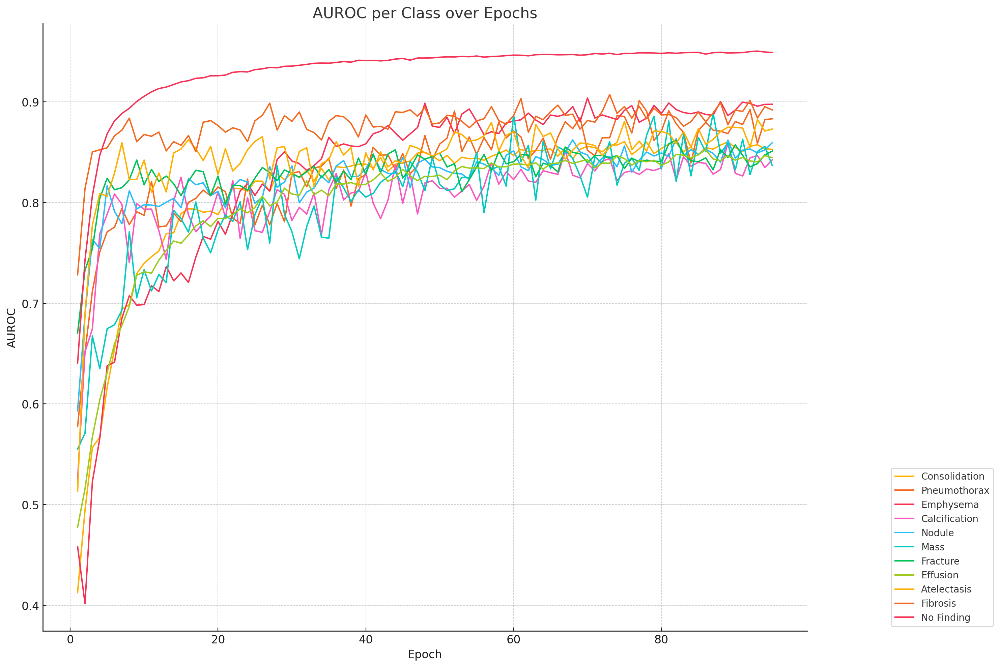

---

### 📉 Training vs Validation Loss with Learning Rate

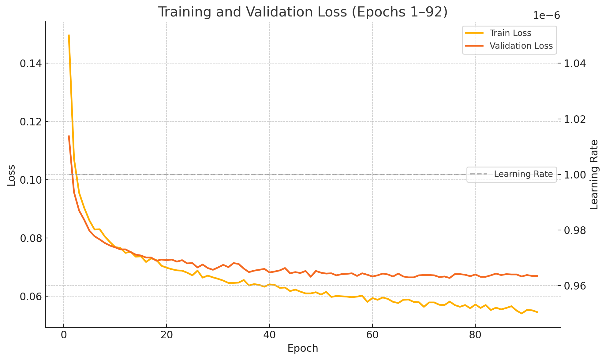

---

### ✅ Summary

The retrained Swin Transformer:

- Outperforms **YOLOv8 classification and detection variants**
- Achieves **AUROC > 0.85** for 9 out of 11 classes  
- Shows excellent performance for difficult pathologies like **Fibrosis**, **Emphysema**, **Fracture**, and **No Finding**
- Generalizes better due to:
  - Early stopping
  - Class-targeted data augmentation
  - Careful LR scheduling and Focal Loss

📌 _These results position the Swin Transformer as a powerful backbone for automated, interpretable medical diagnosis._


