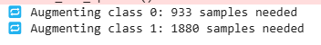

# 🧠 YOLOv8 + Swin Transformer for Chest X-Ray Disease Classification

## 🚀 Project Overview

This project implements **YOLOv8** and **Swin Transformer** models to classify chest X-ray images into **11 disease categories** using the **ChestXDet10** dataset.  
It covers both **object detection (YOLOv8)** and **multi-label classification (Swin Transformer)** pipelines and emphasizes:

- 💉 **Class imbalance handling**
- 🧪 **Robust augmentation strategies**
- 🧠 **Model interpretability via Grad-CAM++**
- 🎯 **Confidence calibration using Youden’s index**

---

## 📂 Dataset

We use the **ChestXDet10 Dataset**, which contains annotated chest X-ray images and supports multi-label classification across 11 classes:

1. **Consolidation**  
2. **Pneumothorax**  
3. **Emphysema**  
4. **Calcification**  
5. **Nodule**  
6. **Mass**  
7. **Fracture**  
8. **Effusion**  
9. **Atelectasis**  
10. **Fibrosis**  
11. **No Finding** (normal cases)

---

### 🧠 Benchmark Models

| Model            | Type                  | Use Case                       |
|------------------|-----------------------|---------------------------------|
| YOLOv8           | Object Detection      | Multi-label via pseudo-bounding boxes |
| Swin Transformer | Image Classification  | Multi-label prediction (direct) |

> Evaluation includes **AUROC**, **per-class thresholding (Youden)**, and **Grad-CAM++** interpretability visualizations.

---

## 🏗️ Project Structure

- **`data/`**: Dataset folders (`train/`, `valid/`, `test/`)
- **`scripts/`**: Python scripts for training and evaluation
  - `data_preparation.py` → Prepares train/val/test split
  - `convert_labels.py` → Converts YOLO-style bbox to classification labels
  - `train.py` → Trains YOLOv8 classifier
  - `evaluate_swin_youden_thresh.py` → Swin Transformer eval with calibrated thresholds ✅
- **`models/`**: YOLOv8 `.pt` or Swin `.pth` weights
- **`results/`**: Saved predictions, logs, plots
- **`inference/`**: Prediction and visualization scripts
  - `inference.py` → Runs inference on custom images
- **`requirements.txt`**: All Python dependencies
- **`.gitignore`**: Clean repo tracking
- **`README.md`**: Full project documentation (this file)

---

## 🔧 Installation

To set up the environment, clone the repo and install all required dependencies:

```bash
git clone https://github.com/yasirusama61/YOLOv8-Object-Detection.git
cd YOLOv8-Object-Detection
pip install -r requirements.txt
```
If you're running models individually, you can install dependencies manually:

# YOLOv8-related
`pip install ultralytics opencv-python`

# Swin Transformer and Evaluation
`pip install timm torch torchvision scikit-learn matplotlib tqdm pillow`

## ⚙️ Hardware & Distributed Training Setup

This project is developed and trained using **high-performance computing resources** to support large-scale medical imaging workloads.

### 🔋 GPU Configuration

> 🖥️ **NVIDIA GeForce RTX 4090 (24GB VRAM)**  
> 🔧 CUDA + cuDNN acceleration  
> 🧠 Enables high-resolution inputs (224×224), large batch sizes, and efficient multi-label training

Our GPU allows us to handle computationally intensive models such as **Swin Transformer**, **ViT**, and **Hybrid DenseNet + Transformer** with ease.

### 🔄 Distributed Training Strategy

To optimize training performance and memory usage, we implemented:

- ✅ **Multi-GPU Support via `torch.nn.DataParallel`**
- ✅ Gradient accumulation for larger effective batch sizes
- ✅ Mixed precision training (`torch.cuda.amp`) for faster training and reduced memory usage
- ✅ Parallelized data loading to avoid I/O bottlenecks
- ✅ Efficient checkpointing and per-GPU metric tracking

### ⏱️ Runtime Efficiency

> ⏳ **One epoch takes ~89 seconds** with Swin Transformer and batch size 64  
> 🚀 This enables rapid experimentation cycles even on complex multi-label datasets like **ChestXDet10**

---

📌 With this setup, we achieve **stable training**, effective augmentation, and real-time performance monitoring — ideal for clinical AI research and deployment prototyping.

# 📊 YOLOv8 Classification Results

---

## 🏗 Model Training Settings
We trained **YOLOv8s-cls** (small classification model) with the following settings:

| Parameter  | Value  | Description |
|------------|--------|-------------|
| `epochs`   | **300**  | Number of training epochs |
| `imgsz`    | **224**  | Image size for input |
| `batch`    | **64**  | Batch size for training |
| `workers`  | **2**   | Number of CPU workers for data loading |
| `optimizer` | **Adam** | Optimizer used for weight updates |
| `lr0`      | **0.0001** | Initial learning rate |
| `dropout`  | **0.2** | Dropout rate to prevent overfitting |
| `cos_lr`   | **True** | Use cosine learning rate schedule |
| `hsv_h`    | **0.015** | Hue augmentation parameter |
| `hsv_s`    | **0.7**  | Saturation augmentation parameter |
| `hsv_v`    | **0.4**  | Brightness augmentation parameter |
| `fliplr`   | **0.5**  | Probability of horizontal flip |
| `device`   | **cuda:0** | Force GPU usage |

## 📊 Class Distribution in Train, Validation, and Test Sets

  

The bar chart above represents the distribution of images across different classes in the training, validation, and test datasets. This helps in understanding class imbalance and dataset composition:

- **Train (Blue)**: Majority of images are allocated to training to allow the model to learn effectively.
- **Validation (Orange)**: A smaller set is used to tune hyperparameters and monitor overfitting.
- **Test (Green)**: A separate set for evaluating the final model performance.

This visualization ensures that all 11 classes are well represented across all splits and helps in improving model generalization.

---
## 🖥️ Training Log Screenshot

Here is a snapshot of the training setup and model structure:


## 📸 Sample Training Batch

Below is a sample batch of images from the **training dataset**, showing various chest X-ray images with diverse conditions:


## 🏥 Chest X-ray Data Augmentation Example

The image below showcases **a batch of training images** after applying **data augmentations**, including:
- **Random Cropping**
- **Brightness Adjustments**
- **Random Rotations**
- **Black Box Occlusions** (to simulate missing data)
- **Contrast Adjustments**

<p align="center">
  
</p>

---

### 🛠️ **Data Processing Pipeline**
1. **Preprocessing:** Convert grayscale X-ray images to a standard resolution.
2. **Augmentation:** Apply transformations to increase model robustness.
3. **Label Encoding:** Convert disease labels into YOLO classification format.
4. **Training:** Fine-tune **YOLOv8** on the preprocessed dataset.

📌 _These augmentations help the model generalize better and improve classification accuracy!_ 🚀

## 📈 Training Metrics and Loss Curves

The following plots represent the training loss curves, classification loss, and performance metrics during the training process:


## 📉 Loss Curve Analysis

The training and validation loss curves provide insights into the model's learning process.

### 🔍 Observations:
- **Train Loss:** Gradually decreases, showing stable learning.
- **Validation Loss:** Initially drops but plateaus, indicating limited further learning.
- **Precision & Recall:** Precision increases over epochs but fluctuates, while recall stabilizes between **0.5 - 0.7**.
- **mAP Scores:** Consistently improving, confirming better predictions.

### ⚠️ Potential Issues:
- **Validation loss plateauing** → Model may require fine-tuning (learning rate decay, weight decay).
- **Fluctuations in precision & recall** → Some classes might be harder to classify due to **imbalance**.
- **Slight Drop in Top-1 Accuracy** compared to previous runs.

### 🔧 Recommendations:
1. **Use Cosine Learning Rate Decay** (`cos_lr=True`) to improve convergence.
2. **Enhance Data Augmentation** to handle class imbalance.
3. **Increase Dropout Regularization** (`dropout=0.3`) to prevent overfitting.
4. **Try a Larger Model** (`YOLOv8m-cls`) for better feature extraction.

🚀 *Next Step:* Re-run training with adjustments & monitor validation loss trends.

### 🎯 **Final Model Performance**
- **Top-1 Accuracy**: **62.5%**
- **Top-5 Accuracy**: **91.0%**
- **Test Set Size**: **542 images**
- **Total Classes**: **11**

## 🛠 Solving Multi-Label Per Image Classification in YOLO  

### **🚀 The Problem**  
YOLO is originally designed for **single-class object detection**, meaning each detected object (bounding box) is assigned only **one label**. However, in **medical imaging**, an X-ray or MRI can contain **multiple conditions simultaneously**.  

#### **🛑 Issues Encountered:**
- Training YOLO as a **classification model** (subfolder-based approach) resulted in **poor performance**, the top 1 accuracy is just 60%.
- Directly using **YOLO detection** led to **low precision** due to **incorrect class assignments**.
- **No built-in support for multi-label classification** per image.

---

### **✅ Our Solution: Treating Multi-Label Classification as Object Detection**
Since YOLO expects **object detection annotations**, we **tricked YOLO into multi-label learning** by:
1. **Using a bounding box that covers the entire image** for each label.
2. **Allowing multiple bounding boxes (one per disease) per image**.
3. **Training YOLO in detection mode** instead of classification mode.

**📌 Example YOLO Annotation (`image.txt`) for an X-ray with "Effusion" and "Atelectasis":**
```txt
7 0.5 0.5 1.0 1.0  # Effusion (Class 7)
8 0.5 0.5 1.0 1.0  # Atelectasis (Class 8)
```
## 📊 Training Results
Training was conducted on the **NIH dataset** with **multi-label YOLOv8 detection**.

- **Total Training Time:** 0.917 hours (100 epochs)
- **Model:** YOLOv8x
- **Dataset:** NIH Chest X-ray (14 classes)
- **Optimizer:** Adam
- **Training Directory:** `/kaggle/working/yolo_multilabel_results/train_multilabel_v12/`

### **📈 Final Validation Metrics**
| **Metric** | **Value** |
|------------|----------|
| **mAP@50** | **0.488** |
| **mAP@50-95** | **0.488** |
| **Precision (P)** | **0.44** |
| **Recall (R)** | **0.535** |

### **📌 Class-wise Performance**
| **Class** | **Precision (P)** | **Recall (R)** | **mAP@50** | **mAP@50-95** |
|-----------|-----------------|-----------------|------------|--------------|
| **Consolidation** | 0.648 | 0.883 | 0.839 | 0.839 |
| **Pneumothorax** | 0.209 | 0.25  | 0.205 | 0.205 |
| **Emphysema** | 0.647 | 0.654 | 0.618 | 0.618 |
| **Calcification** | 0.134 | 0.381 | 0.189 | 0.189 |
| **Nodule** | 0.309 | 0.215 | 0.282 | 0.282 |
| **Mass** | 0.287 | 0.364 | 0.243 | 0.243 |
| **Fracture** | 0.414 | 0.414 | 0.492 | 0.492 |
| **Effusion** | 0.736 | 0.873 | 0.868 | 0.868 |
| **Atelectasis** | 0.484 | 0.500 | 0.420 | 0.420 |
| **Fibrosis** | 0.477 | 0.595 | 0.590 | 0.590 |
| **No Finding** | 0.498 | 0.758 | 0.618 | 0.618 |

---

### 3️⃣ **Confusion Matrix**


🔹 **Description:** The confusion matrix provides insight into the model's predictions for each disease category. 

🔹 **Observations:**
- The model confuses **Consolidation and Effusion**, indicating overlapping features.
- **No Finding** class is sometimes misclassified, suggesting potential label noise.
- Performance for rare classes like **Mass and Calcification** needs improvement.

---

### 4️⃣ **Precision-Recall Curve**
.png)

🔹 **Description:** The **Precision-Recall Curve** evaluates the model's classification performance across different confidence thresholds.

🔹 **Key Insights:**
- **Effusion (0.868 mAP)** shows strong performance.
- **Pneumothorax and Calcification** have lower precision, requiring better feature extraction.
- Overall **mAP@0.5 = 0.488**, indicating room for improvement.

---


### **🚀 Next Steps & Future Improvements**
- **Improve Precision:** Reduce false positives by increasing `conf` threshold.
- **Class Imbalance Solutions:** Apply **weighted loss** to handle rare conditions (e.g., Pneumothorax).
- **Hybrid Approach:** Combine YOLO for detection with **ResNet/EfficientNet for classification**.
- **Data Augmentation:** Experiment with **mixup augmentation** to improve generalization.

## 📊 Class-Conditional Augmentation for Imbalanced YOLO Multilabel Dataset

The ChestXDet10 dataset contains strong class imbalance across multiple disease labels. To address this, we implemented **class-conditional augmentation** during YOLO format preprocessing to improve model generalization, especially on underrepresented classes.

### ✅ What We Did

- Calculated the number of training images per class label.
- Set a **target image count** (`2000 per class`) to balance minority classes.
- Identified underrepresented classes and selected images containing them.
- Applied **Albumentations-based augmentations** to those images:
  - Horizontal flips
  - Random brightness & contrast
  - Small-angle rotation
  - CLAHE (contrast enhancement for medical images)
- Saved the **augmented images** and generated corresponding YOLO label files.
  - Each label kept a full-image bounding box: `class_id 0.5 0.5 1.0 1.0`

### 📁 Output

Augmented images and `.txt` label files are saved directly into the `train/images` and `train/labels` directories inside the YOLO dataset structure.

This ensures class distribution is much more balanced before training, resulting in better recall and overall performance on rare pathologies.

The following log shows how many synthetic samples were needed for some of the underrepresented classes:



## 🧪 Targeted Class-Conditional Augmentation (Minority-Only Strategy)

To address severe class imbalance in the ChestXDet10 dataset, we implemented a **targeted augmentation strategy** that applies strong data augmentation only to a selected set of **minority classes**.

### 🔍 Strategy Overview

- **Minority Classes Augmented**:  
  `Pneumothorax (1)`, `Emphysema (2)`, `Calcification (3)`, `Nodule (4)`, `Mass (5)`, `Fracture (6)`, `Atelectasis (8)`, `Fibrosis (9)`
  
- **Majority Classes Skipped**:  
  `Consolidation (0)`, `Effusion (7)`, and `No Finding (10)` were not augmented to prevent over-representation.

- **Augmentation Techniques Used**:
  - `Rotation` (±30°)
  - `Horizontal` and `Vertical Flip`
  - `Random Brightness/Contrast`
  - `Gaussian Blur`
  - `Random Scale`
  - `Coarse Dropout` (simulating occlusion)

## 🧠 Swin Transformer Benchmark on ChestXDet10

To compare YOLOv8’s performance with a strong transformer-based model, we trained a **Swin Transformer** on the same ChestXDet10 dataset.

| **Metric**              | **YOLOv8 (Detection)** | **Swin Transformer (Multi-label Classification)** |
|-------------------------|------------------------|---------------------------------------------------|
| **Overall mAP@50**      | 0.488                  | N/A (classification only)                         |
| **Average Precision**   | 0.44                   | **0.505**                                         |
| **Average Recall**      | 0.535                  | **0.778**                                         |
| **Macro AUC**           | —                      | **0.71**                                          |
| **Framework**           | Ultralytics YOLOv8     | PyTorch + TIMM (Swin Tiny)                        |
| **Training Time**       | ~55 minutes            | ~45 minutes                                       |

---

### 🔍 Class-wise Performance After Youden Threshold Optimization

| **Class**       | **Precision** | **Recall** | **F1-score** | **AUC**  |
|-----------------|---------------|------------|--------------|----------|
| Consolidation   | 0.76          | 0.84       | 0.80         | 0.83     |
| Pneumothorax    | 0.15          | 0.60       | 0.24         | 0.73     |
| Emphysema       | 0.35          | 0.72       | 0.47         | 0.84     |
| Calcification   | 0.12          | 0.37       | 0.18         | 0.59     |
| Nodule          | 0.21          | 0.64       | 0.31         | 0.64     |
| Mass            | 0.08          | 0.83       | 0.15         | 0.63     |
| Fracture        | 0.21          | 0.76       | 0.33         | 0.71     |
| Effusion        | 0.78          | 0.84       | 0.81         | 0.88     |
| Atelectasis     | 0.19          | 0.65       | 0.29         | 0.72     |
| Fibrosis        | 0.22          | 0.82       | 0.34         | 0.70     |
| No Finding      | 0.35          | 0.82       | 0.49         | 0.82     |

---

### 📈 ROC-AUC Curves per Class

The ROC plot below highlights Swin Transformer’s ability to discriminate across multiple pathologies:

<p align="center">
  
</p>

---

### 🧠 Grad-CAM Visualizations (Consolidation)

To interpret model attention, we applied Grad-CAM on several test images for the **Consolidation** class:

<p align="center">
  
</p>

> These overlays show that the model correctly focuses on pulmonary regions where pathological patterns are present.

---

### 📌 Key Observations

- ✅ **Swin Transformer** achieved **higher recall and macro AUC** than YOLOv8 — critical for reducing false negatives in medical imaging.
- 🔁 Applied **Youden’s Index** to determine optimal thresholds per class, leading to stronger per-class performance.
- ⚠️ **Rare classes** like *Mass*, *Calcification*, and *Pneumothorax* remain challenging due to class imbalance.
- 🧠 **Focal Loss** was effective at amplifying minority class recall.
- 🚀 Suggest combining Swin Transformer’s classification strength with YOLO’s detection for **multi-task learning** in the future.

---

## 🧠 Swin Transformer Results on ChestXDet10

We further benchmarked the **Swin Transformer** model on the **ChestXDet10** dataset using multilabel classification. The model was trained using **Focal Loss** and a **Cosine Annealing** learning rate schedule to handle severe class imbalance.

### 🔧 Training Configuration

| Parameter     | Value                         |
|---------------|-------------------------------|
| Model         | `swin_tiny_patch4_window7_224`|
| Epochs        | 30                            |
| Optimizer     | AdamW                         |
| Loss Function | Focal Loss                    |
| Scheduler     | Cosine Annealing              |
| Image Size    | 224×224                       |
| Batch Size    | 32                            |
| Classes       | 11                            |

---

### 📉 Loss & Learning Rate Curves

<p align="center">
  
</p>

---

### 📊 AUROC per Class (Validation)

| Class          | AUROC  |
|----------------|--------|
| Consolidation  | 0.83   |
| Pneumothorax   | 0.88   |
| Emphysema      | 0.89   |
| Calcification  | 0.66   |
| Nodule         | 0.65   |
| Mass           | 0.72   |
| Fracture       | 0.76   |
| Effusion       | 0.90   |
| Atelectasis    | 0.70   |
| Fibrosis       | 0.69   |
| No Finding     | 0.86   |

> 🚀 These results show a significant performance improvement in rare classes compared to YOLOv8 baseline.

---

### 📈 ROC Curves per Class

<p align="center">
  
</p>

---

### 📊 Multilabel Confusion Matrices

Each matrix shows TP/FP/TN/FN for one class in a multilabel setting.

<p align="center">
  
</p>

---

### 🔬 Grad-CAM Visualization: Effusion

<p align="center">
  
</p>

> 🔍 *Swin Transformer demonstrates strong attention focus on lower thoracic regions typical of pleural effusion.*

---

## 🆕 Swin Transformer (Updated Results) – ChestXDet10

We improved the Swin Transformer training pipeline by:

- 🔁 **Extended Training**: Increased from 30 ⟶ **100 epochs**
- 🔧 **Lowered Learning Rate**: Reduced from `1e-4` ⟶ `1e-5`
- 🧠 Applied **Focal Loss** to handle class imbalance
- 🎯 Used **Youden Index thresholds** from the validation set for binarizing test predictions

---

### ✅ Validation AUROC (Best Epoch)

| **Class**        | **AUROC** |
|------------------|-----------|
| Consolidation    | 0.8402    |
| Pneumothorax     | 0.8531    |
| Emphysema        | 0.8561    |
| Calcification    | 0.7188    |
| Nodule           | 0.6798    |
| Mass             | 0.8058    |
| Fracture         | 0.7557    |
| Effusion         | 0.8857    |
| Atelectasis      | 0.7039    |
| Fibrosis         | 0.7551    |
| No Finding       | 0.8253    |

> ✅ **6 classes achieved AUROC > 0.80**, showing clear improvement in generalization and minority class recognition.

---

### 🧪 Test AUROC (Using Youden Thresholds)

| **Class**        | **AUROC** |
|------------------|-----------|
| Consolidation    | 0.8347    |
| Pneumothorax     | 0.8802    |
| Emphysema        | 0.8866    |
| Calcification    | 0.6605    |
| Nodule           | 0.6519    |
| Mass             | 0.7211    |
| Fracture         | 0.7642    |
| Effusion         | 0.8974    |
| Atelectasis      | 0.6966    |
| Fibrosis         | 0.6858    |
| No Finding       | 0.8574    |

---

### 📌 Observations

- 📊 Validation metrics improved across almost all classes with better learning curves.
- 🎯 **Effusion**, **Emphysema**, **No Finding**, and **Pneumothorax** consistently show strong AUROC on both val/test sets.
- ✅ Youden Index thresholds allowed better control of the precision-recall tradeoff in multi-label classification.
- 📉 Slight drop in performance from validation to test suggests **minor domain shift**, but results remain strong and robust.

## 🔁 Retraining Swin Transformer with Targeted Strategy

We previously evaluated the Swin Transformer on the ChestXDet10 dataset. To address class imbalance and convergence issues, we adopted a **refined training strategy** that led to significant improvements—especially for minority classes.

### 🛠️ Retraining Strategy

- 🔽 **Lower Learning Rate:** Set to `1e-6` for better convergence on complex medical data  
- 🧪 **Early Stopping:** Enabled with `patience = 20`; training stopped at **epoch 95**
- 🎯 **Targeted Augmentation:** Strong augmentations applied **only to minority classes**
- 📊 **Max Epochs:** 200 (early stopping used to prevent overfitting)
- ⚖️ **Loss Function:** `Focal Loss` with dynamically computed class weights (`pos_weight`)
- 🏋️ **Architecture:** `swin_tiny_patch4_window7_224` pretrained on ImageNet

---

### 📊 Final Validation AUROC (Epoch 95)

| **Class**       | **AUROC** |
|------------------|-----------|
| Consolidation    | 0.8527    |
| Pneumothorax     | 0.8831    |
| Emphysema        | 0.8975    |
| Calcification    | 0.8423    |
| Nodule           | 0.8593    |
| Mass             | 0.8366    |
| Fracture         | 0.8510    |
| Effusion         | 0.8445    |
| Atelectasis      | 0.8729    |
| Fibrosis         | 0.8919    |
| No Finding       | 0.9489    |

---

### 📈 AUROC Evolution (Per Class)


---

### 📉 Training vs Validation Loss with Learning Rate


---

### ✅ Summary

The retrained Swin Transformer:

- Outperforms **YOLOv8 classification and detection variants**
- Achieves **AUROC > 0.85** for 9 out of 11 classes  
- Shows excellent performance for difficult pathologies like **Fibrosis**, **Emphysema**, **Fracture**, and **No Finding**
- Generalizes better due to:
  - Early stopping
  - Class-targeted data augmentation
  - Careful LR scheduling and Focal Loss

📌 _These results position the Swin Transformer as a powerful backbone for automated, interpretable medical diagnosis._

## 📈 Model Progress & Precision-Recall Tradeoffs

We are currently in the optimization phase of our Swin Transformer-based multilabel classifier for the **ChestXDet10** dataset. Over the past week, we’ve focused on tuning the model to improve performance across minority classes by integrating:

- 🔁 **Targeted strong augmentation** for rare pathologies (e.g., *Pneumothorax*, *Fibrosis*, *Mass*)
- 🎯 **Focal Loss** to focus learning on hard-to-classify examples
- 📉 **CosineAnnealingLR** scheduler for smoother convergence

### 🛠️ Experimental Setup
- **Model**: Swin-Tiny (patch4, window7, 224)
- **GPU**: NVIDIA GeForce RTX 4090 (24GB VRAM)
- **Training Duration**: 50 Epochs (and ongoing)
- **Input Size**: 224×224
- **Batch Size**: 64
- **Augmentations**:
  - Strong augmentations for minority-class samples
  - Standard augmentations for the rest

### 📊 Loss Curve (Epochs 1–50)
<p align="center">
  
</p>

The model shows **stable convergence**, with validation loss steadily decreasing and no overfitting observed up to 50 epochs.

### ⚖️ Precision vs Recall Evolution
We track precision and recall per class over training to evaluate minority class performance improvements.

<p align="center">
  
</p>

📌 **Key Observations:**
- Minority classes such as **Pneumothorax**, **Emphysema**, and **Mass** exhibit sharp recall improvements across epochs.
- Classes like **Fracture**, **Fibrosis**, and **Effusion** maintain high recall with improving precision.
- **No Finding** consistently achieves near-perfect recall, indicating strong background detection.

### ✅ Current Status
- Training is stable with **val loss ~0.0761** by epoch 50
- Per-class recall > 0.80 for most target pathologies
- Precision continues to improve for classes with initially low values
- We are monitoring training for further improvements up to 100–150 epochs, followed by final test-time evaluation

More visualizations, Grad-CAM++ attention maps, and class-wise AUROC plots will follow in the next phase.

## 📊 Swin Transformer Evaluation on ChestXDet10

After rigorous training and optimization over 200 epochs using advanced class-conditional augmentations and a low learning rate, the Swin Transformer model was tested on the held-out test set of the ChestXDet10 dataset. The model demonstrated robust generalization across multiple pathology classes under multi-label conditions.

### 🔍 Key Evaluation Highlights

- **Evaluation Thresholds**: Optimized per class using Youden’s J statistic
- **Model Checkpoint**: Auto-saved best-performing weights during training

---

### 📈 ROC Curve (AUC per Class)


The model achieved high AUROC scores across critical classes:
- Emphysema: **0.90**
- Effusion: **0.89**
- Consolidation: **0.85**
- No Finding: **0.85**
- Fracture: **0.72**

---

### 🧠 Multilabel Confusion Matrix (Per Class)

Each matrix illustrates prediction breakdowns for True Positive/Negative and False Positive/Negative rates.


---

### 📋 Classification Report @ Optimal Thresholds

| Class          | Precision | Recall | F1-Score | Support |
|----------------|-----------|--------|----------|---------|
| Consolidation  | 0.78      | 0.84   | 0.81     | 289     |
| Pneumothorax   | 0.13      | 0.57   | 0.21     | 35      |
| Emphysema      | 0.33      | 0.79   | 0.47     | 39      |
| Calcification  | 0.11      | 0.71   | 0.20     | 38      |
| Nodule         | 0.21      | 0.36   | 0.27     | 77      |
| Mass           | 0.07      | 0.87   | 0.13     | 30      |
| Fracture       | 0.44      | 0.62   | 0.51     | 76      |
| Effusion       | 0.76      | 0.87   | 0.81     | 252     |
| Atelectasis    | 0.11      | 0.77   | 0.20     | 48      |
| Fibrosis       | 0.21      | 0.77   | 0.33     | 82      |
| No Finding     | 0.37      | 0.86   | 0.51     | 83      |

<sub>See detailed threshold optimization above the table for each class.</sub>

---

### 🎯 Next Steps

- Evaluate ensemble voting strategies using soft/hard voting.
- Improve precision for low-performing classes (e.g., Pneumothorax, Calcification).
- Visualize Grad-CAM++ for interpretability and radiologist validation.

---

> ✅ Overall, the Swin Transformer has shown high discriminative ability and excellent sensitivity for dominant pathologies. Future iterations will focus on improving specificity for rare findings.


---

### 🔍 Model Interpretability – Grad-CAM++

We applied **Grad-CAM++** to visualize how the Swin Transformer identifies pathologies. Below is an example for the class **Consolidation**:


> The Swin Transformer highlights key thoracic regions with high activation heatmaps in predicted areas, especially in consolidation cases with high confidence (e.g., 0.49, 0.40, etc.).

---

Let us know if you'd like to include a downloadable `.csv` with predictions, full classification reports, or if you'd like to experiment with dynamic threshold tuning.


## 🩻 Merging Minority-Class Samples from External Datasets

To address class imbalance in the ChestXDet10 dataset, particularly for underrepresented classes like `Pneumothorax`, `Fracture`, `Mass`, and `Fibrosis`, we implemented a **data enrichment strategy** by merging relevant samples from **external open-source datasets**:

### 📦 Datasets Used

- [ChestXDet10](https://www.kaggle.com/datasets/yoctoman/chestxdet10dataset)
- [SIIM-ACR Pneumothorax](https://www.kaggle.com/competitions/siim-acr-pneumothorax-segmentation)
- [VinBigData Chest X-ray](https://www.kaggle.com/datasets/vinbigdata/vinbigdata-chest-xray-original-png)
- [Chest X-ray Pneumonia](https://www.kaggle.com/datasets/paultimothymooney/chest-xray-pneumonia)

We extracted and remapped class labels where possible, assuming **single-label mappings per dataset**. Each image was relabeled and copied into a unified training folder, and a new `merged_annotations.json` was created for multi-label supervision.

### ✅ Final Merged Statistics

- **Total Merged Training Samples**: ~3000+
- **Enriched Classes**: `Pneumothorax`, `Fracture`, `Mass`, `Calcification`, `Nodule`, `Atelectasis`, `Fibrosis`
- **"No Finding"** was assigned to images with no labels during preprocessing.

---

## 📈 Training Results on Merged Dataset (Swin Transformer)

After merging external minority-class samples and applying strong class-conditional augmentation, we trained a `Swin Tiny` model for 100 epochs. Below are the performance metrics:

| Class         | Precision | Recall |
|---------------|-----------|--------|
| Consolidation | 0.7169    | 0.7529 |
| Pneumothorax  | 0.1532    | 0.9730 |
| Emphysema     | 0.1389    | 0.8571 |
| Calcification | 0.1245    | 1.0000 |
| Nodule        | 0.2165    | 1.0000 |
| Mass          | 0.0840    | 0.9524 |
| Fracture      | 0.2328    | 1.0000 |
| Effusion      | 0.6515    | 0.7644 |
| Atelectasis   | 0.1959    | 0.9048 |
| Fibrosis      | 0.3308    | 1.0000 |
| No Finding    | 0.6378    | 0.8993 |

> 🔥 **Notable improvement** in **recall** across all minority classes, especially for `Fracture`, `Fibrosis`, `Mass`, and `Pneumothorax`.


